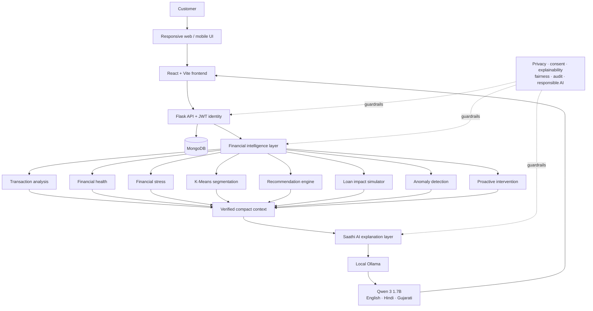
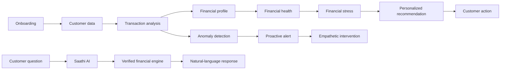

# Paisa Saathi architecture

Paisa Saathi follows one product loop: **data → understanding → personalization → explanation → proactive action → customer benefit**. Financial values and decisions remain deterministic; the local language model explains verified results.

## End-to-end customer journeys

Security boundaries: JWT identity selects one customer; URL parameters cannot switch authenticated identity; demo sessions are restricted to an allowlist of synthetic profiles; Ollama is loopback-only; KYC is a non-persistent synthetic prototype.
